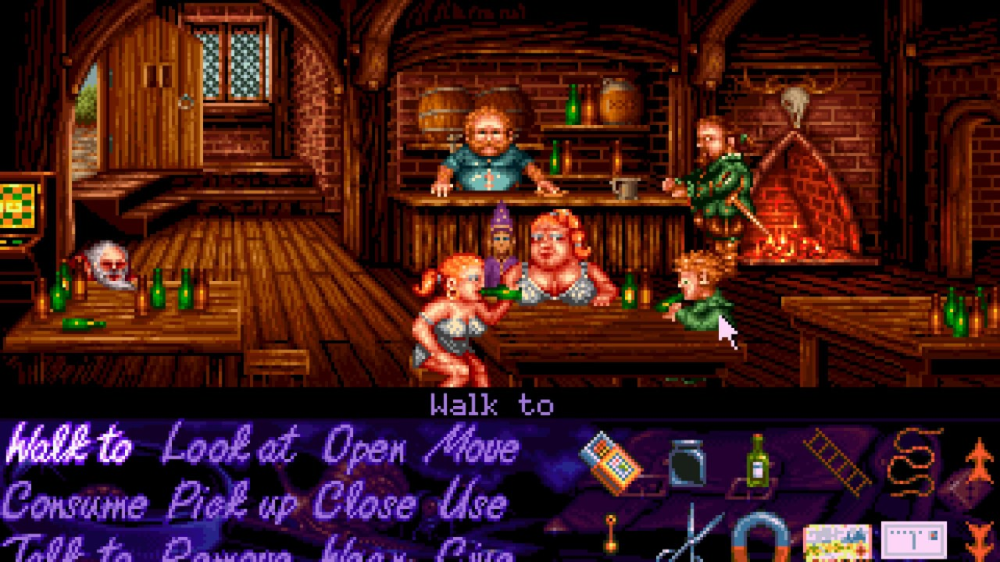
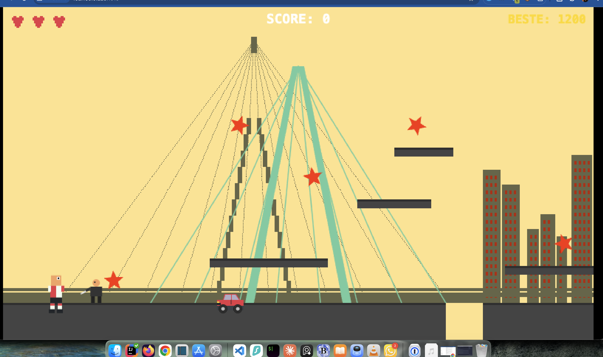
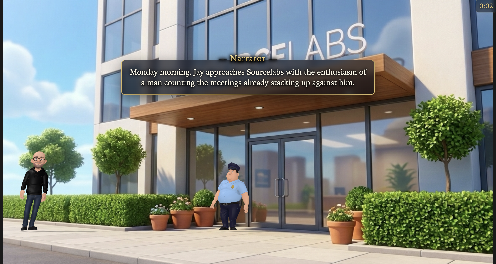
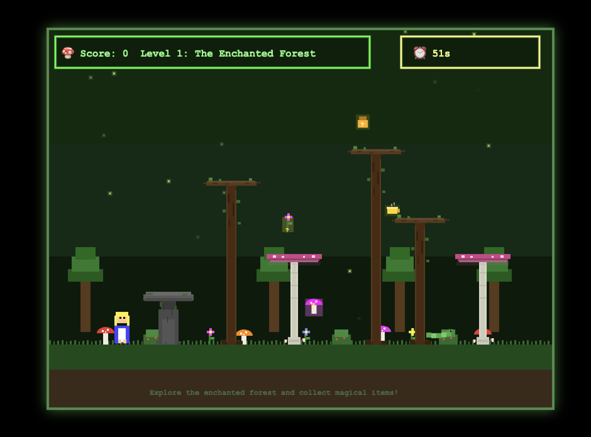

Today it was my go to lead the monthly Sourcelabs meetup day.

For my turn I decided to change things up a bit. Instead of studying a new technology/framework/platform for a month
and then teaching my colleagues a set of skills over the course of a day I went with a much lazier approach.

Instead I decided to a do a single day Hackathon Competition.

All I told my colleagues ahead of the day itself was that:

* They would have to make a game in a day.
* Making the game ahead of time, or even the specs for it will not give you an edge because..
* The rules of the competition will be revealed on the day itself

I also promised 100 euros cold hard cash to the winning game.

On the day itself I revealed what the day was going to be about:

Growing up in the 90's and 00's I used to play a lot of video games.
Command & Conquer, Age of Empires, Simon the Sorcerer, Jazz Jackrabbit, Doom, Quake, Duke Nukem, Turok... the list goes on and on.

*Simon the Sorcerer - one of my favourites*

I loved those games. 

My dad did not.

They were violent and often came with 18+ certifications. 

So sometimes I would ask "Daaaaad may I please play on the computer?" to which he would almost invariable answer "Yes.... but only EDUCATIONAL games"

At first I would accept this methadone-like substitution for my computer based blood lust and play "Encarta '95" or whatever *dad approved* software he allowed me to run. But after a while my brother and I realised we could sometimes convince him "No no no dad! Age of Empires... IS EDUCATIONAL!! It is a history and strategy game that teaches us about famous battles and civilisations and culture"

And so the only stipulations for the game hackathon would be:

1. It must be fun
2. It must be educational (or at least you must be able to plead its case)
3. It must be retro

And that was it. My colleagues began.

Watching the reactions was intriguing. 

Most people dove into a corner, popped on some headphones and got to it.

Some people lamented "Ohh I don't use AI at work, I don't have the experience to do this" or "I don't play games" or some other excuse. I helped whoever needed help to get up and running (i.e. gave them access to my codex pro account and installed opencode with openspec).

I have done a lot of these training days over the years (some of my training subjects: Akka, Kafka, Phaser, Unity, Databricks, Neo4J, WebAssembly) and this was by far the most successful. I'll tell you why:

* I have never seen my colleagues this quiet. There were many looks of intense focussed concentration.
* There was a lot of swearing " Oh FOR F@#$S SAKE!? WHY?!?!!?"
* There was a lot of victorious air punches "YESSSSSSSSSSS!!!!!! .... It works"
* When my (slightly impatient) colleague asked if we could wrap things up an hour and half earlier than I had originally planned I floated this past my other colleagues "Heeyy Guyzzzz... sooo some of us are already done with their projects and I was just wondering how you would feel about stopping a bit earlier?"  this was greeted by a very angry chorus of "WHAT!!!?!?!??!  NO!...... NO that was not the original agreement" 

*Learn about Rotterdam, don't get stabbed*

At 15:00 or so an ex-sourcelabser came by and made the comment "I've never seen everyone pay so much attention at the end of a workshop day" and he was right. Normally, after a full work week on a Friday by the time 15:00-16:00 rolls around we're all pretty beat and looking forward to a nice dinner out together and the start of the weekend. But this time I could see people urgently fixing those last bugs, adding that last feature.

Then at around 16:00 we demoed the games. Each game was demoed by the creator for a few minutes, then the game (which also had to be hosted) could be played by the group for a few minutes.

The main point I wanted to make with my day's activity was: you can do achieve a lot in one day if you are motivated and having fun. 

But I was not ready for what I was about to see. My colleagues blew me away with what they made.

A few examples:

* A full on 3-d point and click adventure engine that had our office as the environment of play
* A 2d Tony Hawkesque maths game
* A geography game where one drives around the Netherlands answering general knowledge questions
* An Alice in Wonderland quiz game
* A hotel maths game
* A space invaders maths game
* A circuitry based logic puzzle game
* and many more

*A screenshot from after the hackathon of the fully playable game*

I somewhat regretted making it a competition since so many of these games were phenomenally impressive.

I announced the victor, Elena, who had created a truly enchanting Alice in Wonderland game, complete with music, fun questions, novel level concepts and a very modern retro aesthetic. She then refused, despite several insistances on my part, to take the 100 euros prize money. I could see my Dutch colleagues wincing in physical pain as I knew they would have had zero trouble taking the cash. 

All in all I really enjoyed showing people that today with the combintaion of cold calculating robotic agentic AI and their own warm impossible-to-truly-replace human creativity they could achieve much more than they perhaps thought they could and they could truly enjoy it.

*The winning game's first level*
